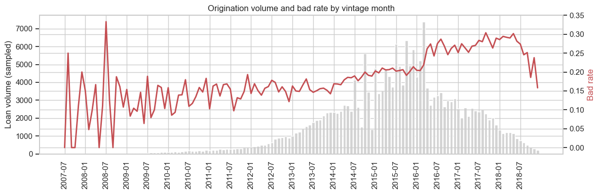
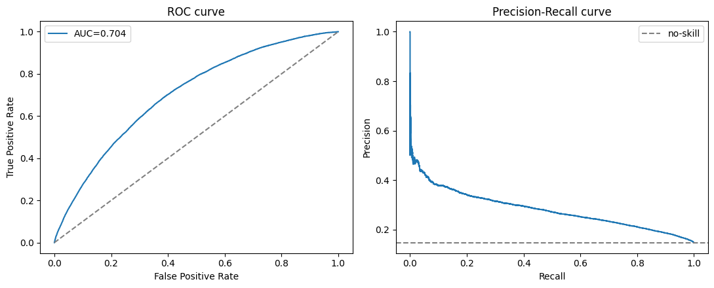
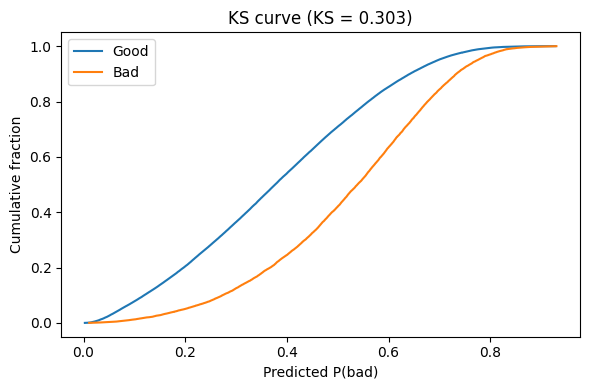
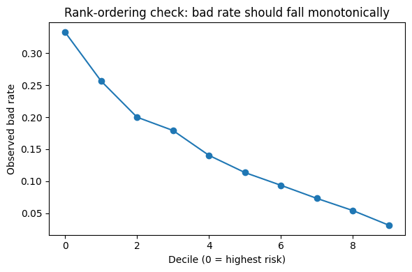
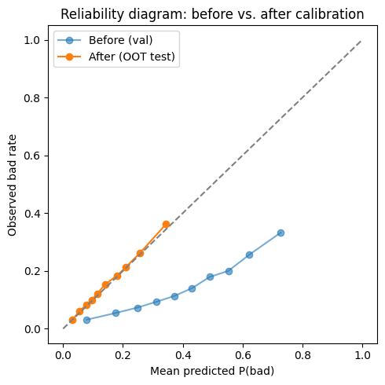
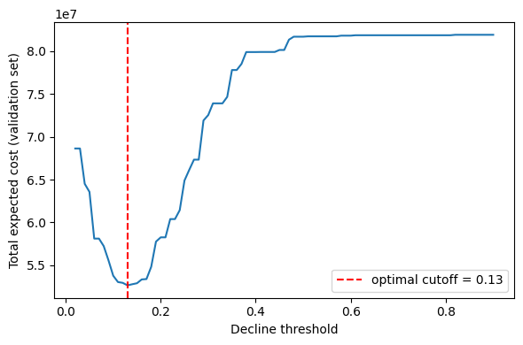
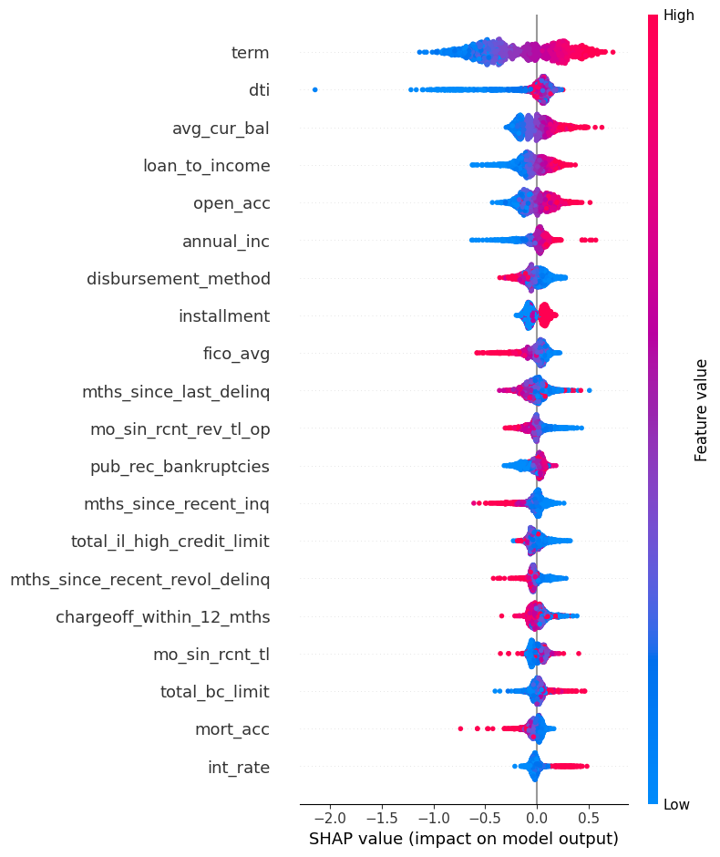

# Credit Risk Default Prediction — Lending Club

A complete, five-notebook walkthrough of building a credit default model end-to-end: from raw loan-level data to a calibrated, cost-optimized, explainable scoring pipeline — plus a traditional points-based scorecard as a fully transparent alternative.

**Data source:** [Lending Club Accepted Loans (Kaggle)](https://www.kaggle.com/datasets/wordsforthewise/lending-club/data) — `accepted_2007_to_2018Q4.csv`, ~2.26M rows × 151 columns, ~1.6GB, loans originated 2007–2018.

The workflow emphasizes:
- Rigorous target definition, a leakage keyword screen (44 fields flagged and dropped), and a maturity/seasoning filter that corrects for survivorship bias in recent loan vintages
- An **out-of-time (OOT)** train/val/test split that actually rehearses deployment, instead of a random split that would hide population drift
- A fair, apples-to-apples imbalance-handling bake-off (class weighting vs. under/oversampling) and a documented model-zoo comparison
- Strict separation of **discrimination** (does it rank-order risk?) from **calibration** (are the probabilities trustworthy numbers?) — isotonic calibration cuts Brier score by ~37% on the untouched OOT test set
- A **cost-based** accept/decline threshold tied to an explicit business trade-off, not a generic 0.5 or F1-optimal default
- **SHAP**-based global/local explainability, plus a traditional WOE/points scorecard as a fully transparent alternative

## Scope

This project deliberately stops at explainability. It doesn't include model monitoring, fairness/disparate-impact testing, or production deployment packaging — that framing leans heavily on US-specific regulatory concepts (e.g. ECOA/Regulation B protected classes), which don't map cleanly onto an Indian lending context. Everything through calibration, cost-based decisioning, and explainability is fully covered.

## Repository structure

```
.
├── 01_eda.ipynb
├── 02_feature_engineering_and_split.ipynb
├── 03_imbalance_and_modeling.ipynb
├── 04_evaluation_and_calibration.ipynb
├── 05_explainability_and_scorecard.ipynb
├── assets/                          # charts exported for this README
├── accepted_2007_to_2018Q4.csv      # raw data — download separately, see Data section
├── train.csv / val.csv / test.csv   # generated by notebook 02
├── iv_table.csv                     # generated by notebook 02
├── preprocess.joblib                # generated by notebook 03
├── xgb_raw_model.joblib             # generated by notebook 03
├── model_comparison.csv             # generated by notebook 03
├── xgb_calibrated_model.joblib      # generated by notebook 04
└── decision_config.json             # generated by notebook 04
```

The raw CSV and the generated `.csv`/`.joblib` artifacts aren't checked into the repo — add them to `.gitignore` and regenerate by running the notebooks in order.

## Results at a glance

| Metric | Value |
|---|---|
| Modeling population (after seasoning filter) | 673,622 completed loans |
| Train / Val / Test split (out-of-time, by `issue_d`) | 492,256 / 92,633 / 88,733 |
| Bad rate — train / val / test | 14.8% / 14.7% / 14.9% |
| Final model | XGBoost, Optuna-tuned, `scale_pos_weight` |
| Validation ROC-AUC (Gini) / KS | 0.704 (0.408) / 0.303 |
| OOT test ROC-AUC (Gini) | 0.704 (0.407) |
| Brier score, OOT test — before / after calibration | 0.188 → 0.118 (≈37% lower) |
| Chosen decline threshold (cost-based) | 0.130 |
| Approved-population bad rate at that threshold | 8.1% (vs. 14.9% unfiltered) |

## 1 — Exploratory Data Analysis (`01_eda.ipynb`)

Worked from a 15%, chunk-sampled slice of the raw file (339K rows) for fast iteration.

- **Target definition**: `loan_status` mixes finished loans (Fully Paid / Charged Off / Default / Late) with open ones (Current, In Grace Period) — only finished loans have a known outcome. On the sample, 60.6% of rows qualify, with a 21.4% bad rate among them.
- **Survivorship bias in recent vintages**: restricting to "completed" loans quietly over-represents charge-offs for young vintages, since good loans haven't had time to reach `Fully Paid` yet — fixed with a maturity/seasoning filter in notebook 02.
- **Missingness is two different things**: bureau fields like `mths_since_last_delinq` are missing 50–76% of the time and that almost always means "never delinquent" (structural); `dti`/`emp_length` missingness is closer to random/operational — each needs different imputation logic.
- **Population drift** over the 11-year window — origination volume and bad rate both shift materially over time, the direct justification for an out-of-time split rather than a random one:

  

- `int_rate` / `grade` / `sub_grade` show the cleanest, most monotonic relationship with default — expected, since they partly encode Lending Club's own risk-based pricing rather than independent signal.

## 2 — Feature Engineering, Leakage Control & Split (`02_feature_engineering_and_split.ipynb`)

Turns the raw file into `train.csv` / `val.csv` / `test.csv`. Run on the full 2,260,701-row file, not a sample.

| Step | Effect |
|---|---|
| Completed-status filter | 2,260,701 → 1,371,166 rows (bad rate 21.5%) |
| Maturity/seasoning filter (drop unripe 36/60-month loans) | → 673,622 rows (bad rate 14.8%) |
| Drop IDs & near-duplicate amount fields | 8 columns dropped |
| Leakage keyword screen (payments, recoveries, hardship, settlement, post-funding dates) | 44 columns dropped |
| Drop >70%-missing columns | 31 columns dropped → 70 columns remain |
| Domain-aware imputation | zero-fill for structurally-absent fields; median-fill + missingness indicator for the rest |
| Feature engineering | added `credit_history_years`, `fico_avg`, `loan_to_income`, `installment_to_income`, `open_acc_ratio`; dropped redundant `grade` and `earliest_cr_line` |
| Information Value (IV) screening | a leakage sanity-check as much as a metric — no feature scored above the "investigate me" (IV > 0.5) threshold |
| **Out-of-time split** (70/15/15 by `issue_d`) | train: 2007-06 → 2015-05 · val: 2015-06 → 2015-09 · test: 2015-10 → 2015-12 |

Categorical/numeric encoding is deliberately deferred to the modeling `Pipeline` in notebook 03, fit only on training folds, so it can never leak into validation or test.

Top features by Information Value: `sub_grade` (0.387, strong), `int_rate` (0.350, strong), `fico_avg` (0.125, medium) — everything else falls in the "weak" band. Final feature count: **101** (excluding target).

## 3 — Class Imbalance & Model Selection (`03_imbalance_and_modeling.ipynb`)

**Imbalance bake-off** (logistic regression, validation set) — at this dataset's ~15% bad rate (mild-to-moderate, nowhere near fraud-level imbalance), the techniques land close together on ranking metrics:

| Technique | ROC-AUC | PR-AUC | F1 @ 0.5 |
|---|---|---|---|
| No handling | 0.7018 | 0.2763 | 0.016 |
| Class weighting | 0.7031 | 0.2746 | 0.353 |
| Random undersampling | 0.7025 | 0.2743 | 0.352 |
| SMOTE | 0.6975 | 0.2686 | 0.351 |

Class weighting is the practical default here — it slightly edges out both resampling techniques on ranking metrics, and unlike leaving the model unweighted (F1 of 0.016 — it almost never predicts the positive class at a naive 0.5 cutoff), it doesn't require touching the training data itself. The trade-off: the weighted model's *average* predicted probability drifts to 44.3% against a true 14.7% bad rate (the unweighted model stays close, at 14.0%) — a concrete demonstration of why calibration (notebook 04) is a required follow-up whenever weighting or resampling is used.

**Model zoo** (validation set):

| Model | ROC-AUC | PR-AUC | F1 @ 0.5 |
|---|---|---|---|
| LightGBM | 0.7108 | 0.2892 | 0.357 |
| XGBoost | 0.7107 | 0.2891 | 0.358 |
| Logistic Regression | 0.7027 | 0.2770 | 0.353 |
| Random Forest | 0.7012 | 0.2732 | 0.354 |

Gradient boosting edges out the linear baseline, but not dramatically — worth reporting honestly rather than assuming a bigger gap.

**Hyperparameter tuning**: Optuna + `TimeSeriesSplit` (4 expanding-window folds), mirroring the OOT discipline from notebook 02 inside the tuning loop itself. Best trial: `max_depth=6, learning_rate=0.090, min_child_weight=6, subsample=0.999, colsample_bytree=0.945` (log-loss 0.514).

Final tuned XGBoost — **validation**: ROC-AUC 0.7038 / PR-AUC 0.2811. **OOT test**: ROC-AUC 0.7035 / PR-AUC 0.2857. The small, consistent val→test gap is the expected, healthy signature of an OOT design; a large drop would have signaled overfitting to development-window patterns.

## 4 — Evaluation Suite & Probability Calibration (`04_evaluation_and_calibration.ipynb`)

Separates two genuinely different questions: does the model **rank-order** risk well (discrimination), and are its predicted probabilities **trustworthy numbers** (calibration)?

**Discrimination** (validation set): ROC-AUC 0.704 (Gini 0.408), KS statistic 0.303 — comfortably inside the 0.3–0.5 range considered typical for a decent retail-credit scorecard.

<p align="center">
  
  
</p>

Decile rank-ordering is clean and monotonic — the riskiest 10% of applicants carry a 33.3% bad rate (2.26x lift) vs. 3.1% in the safest decile:



**Calibration**: class weighting (notebook 03) inflates predicted probabilities, so raw XGBoost output isn't trustworthy as a default probability out of the box (Brier score 0.193 on validation). `CalibratedClassifierCV` (isotonic) is fit on the *validation* set only — the OOT test set stays untouched until the final report — and the fix holds: Brier score on the untouched test set drops from 0.188 to 0.118 (≈37% lower) while ROC-AUC barely moves (0.7035 → 0.7030), exactly as expected — calibration fixes what the scores *mean*, not what the model is good at.



**From score to decision**: rather than a generic 0.5 or F1-optimal cutoff, the decline threshold comes from an explicit (illustrative) cost trade-off — approving a loan that defaults costs ~$6,000 (unrecovered principal); declining one that would've performed costs ~$900 (lost interest margin):



Optimal threshold: **0.130**. At that cutoff on the OOT test set: 44.8% decline rate, approved-population bad rate falls to 8.1% (from 14.9% unfiltered), confusion matrix TN=45,020 / FP=30,511 / FN=3,965 / TP=9,237.

## 5 — Explainability & a Traditional Scorecard (`05_explainability_and_scorecard.ipynb`)

**SHAP** (`TreeExplainer`, 2,000-row validation sample) drives both global and per-loan explanations:



A genuinely interesting result: loan `term` is by far the single most influential feature by mean |SHAP value| (0.36), followed by `dti` (0.13), `avg_cur_bal` (0.12), `loan_to_income` (0.12), and `open_acc` (0.11) — cross-checked against, and agreeing with, permutation importance. That's a real divergence from the univariate IV screening in notebook 02, where `sub_grade` and `int_rate` were by far the strongest *individual* predictors (IV 0.39 and 0.35) but barely register among the trained model's actual top drivers (`int_rate` sits near the bottom of the top-20 SHAP ranking; `sub_grade` doesn't appear at all). A feature's univariate predictive power and its importance inside a model conditioned on everything else are answering different questions — they don't have to agree.

**Adverse-action reason codes**: for a declined applicant, keep only the risk-increasing SHAP contributions and report the top few in plain language — directly usable as an ECOA/Reg-B-style adverse-action deliverable in a US context, or as a general good-practice "why was this declined" explanation elsewhere.

**Traditional WOE/points scorecard**: a parallel, fully transparent alternative built from WOE-transformed bins + logistic regression on the three medium/strong-IV features (`sub_grade`, `int_rate`, `fico_avg`), scaled FICO-style (20 points to double the odds, base score 600 at 50:1 good:bad odds):

| Feature | Points range across bins | Direction |
|---|---|---|
| `sub_grade` | 141.8 (G3) – 231.3 (A1) | Cleanly monotonic — safer grade, more points |
| `fico_avg` | 177.9 (lowest FICO bin) – 182.0 (highest FICO bin) | Cleanly monotonic — higher FICO, more points |
| `int_rate` | 178.7 – 179.5 pts (~0.8-pt spread) | **Inverted** — see caveat below |

*(`sub_grade`'s tail bins have small sample sizes and aren't perfectly monotonic within them — G3, with only 291 loans, edges out F5 for the single lowest score.)*

Worth keeping visible rather than rounding off: the fitted `int_rate` coefficient comes out with the "wrong" sign (+0.016, vs. negative for the other two features) — under this WOE convention, a sound bad-risk model should show negative coefficients throughout. In practice it shows up as a nearly flat *and reversed* points range for `int_rate` (178.7 → 179.5 pts as the rate rises, a ~0.8-point spread against sub_grade's ~90-point spread) rather than any dramatic mis-scoring — but it's exactly the kind of non-monotonicity a production scorecard build would need to re-bin and fix before shipping.

## How to run

1. Download `accepted_2007_to_2018Q4.csv` from the [Kaggle dataset](https://www.kaggle.com/datasets/wordsforthewise/lending-club/data) into the repo root.
2. Run the notebooks in order, 01 → 05. Notebooks 02–05 each depend on the CSV/joblib artifacts produced by the notebook(s) before them.

```bash
pip install pandas numpy scikit-learn xgboost lightgbm imbalanced-learn optuna shap matplotlib seaborn scipy joblib
```

## Tech stack

pandas · NumPy · scikit-learn (`ColumnTransformer`, `TargetEncoder`, `CalibratedClassifierCV`, `PartialDependenceDisplay`, permutation importance) · XGBoost · LightGBM · imbalanced-learn (SMOTE, `RandomUnderSampler`) · Optuna (Bayesian search with `TimeSeriesSplit`) · SHAP · matplotlib / seaborn

## Data & license note

The Lending Club dataset is distributed on Kaggle under its own terms — see the [dataset page](https://www.kaggle.com/datasets/wordsforthewise/lending-club/data) before redistributing it. This repository contains code and analysis only; the raw CSV is not included.
